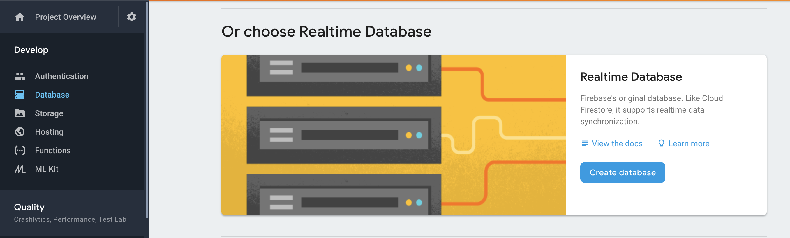

# Setting up Firebase

## What is Firebase?

* Firebase is a backend as a service

## What you need to get started

* A google account

## Create a Firebase Project

* Go to [https://console.firebase.google.com](https://console.firebase.google.com)

* Click on "Add Project"

* Give your project a name and ID. Hit continue

* Hit continue when the project has finished setting up

* Your landing screen should look like:

* Click on the  button on the landing page. These are your firebase API keys. They are allowed to be public, so don't worry about sharing this on GitHub. Make note of these keys, as we will use them later. For example, here are mine:

* On the sidebar of the Firebase console, click "Authentication". Then click on the "Sign-In method" tab. You should see:

* Click on "Set up sign in method", and then click the pencil button on Email/Password. A pop up should show up:

* Enable email. The authentication panel now looks like:

* Next, go to the Database section from the sidebar, and scroll down to "Or choose Realtime Database":

* Click Enable. You can start your database in Test mode, we will change these rules in the next step.

* Now navigate to https://dev.swipesforscience.org and scroll to the bottom and click "Configure"
